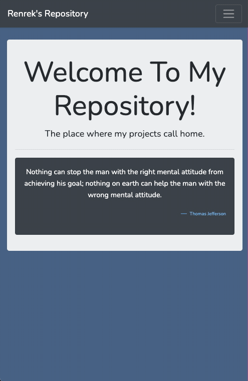

# Quote Collecter

## Description

_Duration: 1 weekend_

A simple Laravel app hosted on a LAMP stack. Uses as the template to collect quotes, 
display one on visting the page. This is a template used to add more utility to as my
hobby projects grow. It is also a means to keep my PHP skills limber.

To see the fully functional site, please visit: [Live Site](https://renrek.com)

## Prerequisites

- [Composer](https://getcomposer.org/)
- [PHP](https://www.php.net/)
- [SqLite](https://www.sqlite.org/index.html)

## Built With

1. Laravel
1. MariaDB - Production
1. SQLite - Development
1. PHP

## Support
If you have suggestions or issues, please email me at [brad.d.johansen@gmail.com](brad.d.johansen@gmail.com)
